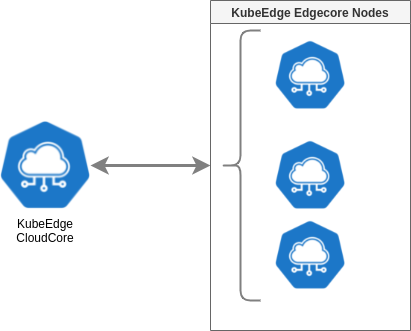

# Edge Computing Benchmark

Cloud computing represents the de-facto standard for computing today, where a user can summon a
large fleet of servers, and deploy a variety of user-customized infrastructure services (storage, resource
management, scaling, monitoring) on them in a few clicks. In contrast to cloud computing, edge computing is an emerging computing paradigm where the majority of data is generated and processed in the
field using decentralized, heterogeneous, and mobile computing devices and servers, often with limited
resources.

-------------

This repository contains Terraform code (Infrastructure-as-Code) to deploy KubeEdge, a Kubernetes based resource manager for the edge, onto the Google Cloud Platform and code to test KubeEdge locally using Vagrant. This repository provides code to benchmark the resource manager by varying the amount of cloud resources (Edgecore Nodes) and see the impact on the performance of KubeEdge as an edge resource manager.

## Infrastructure setup

### Local infrastructure



In the local infrastructure, 1 CloudCore VM and 1 or more Edgecore VMs are created within the same private network. Applications are deployed through the CloudCore instance to the Edgecore nodes.

## Local Setup

For the local setup, Vagrant from Hashicorp is used. It provides a way to deploy VMs with a Hypervisor of choice on a easy way with the configuration declared in a Vagrantfile. In order to execute KubeEdge locally, we need to install Vagrant and Virtualbox.

1.   Download and install Virtualbox: https://www.virtualbox.org/wiki/Downloads
2.   Download and install Vagrant: https://www.vagrantup.com/downloads. More information about the installation can be found here: https://www.vagrantup.com/docs/installation. Be aware that running Vagrant with multiple hypervisors can cause problems, as mentioned in the documentation of Vagrant.
3.   Clone this repository if not done already and navigate to the folder `local_benchmark`.

We take a closer look on the Vagrant file:

```ruby
# -*- mode: ruby -*-
# vi: set ft=ruby :

Vagrant.configure("2") do |config|
  config.vm.define "cloudcore" do |cloudcore|
    cloudcore.vm.box = "ubuntu/bionic64"
    cloudcore.vm.hostname = "cloudcore"
    cloudcore.vm.synced_folder "manifests/", "/home/vagrant/manifests"
    cloudcore.vm.network "private_network", ip: "192.168.56.2"

    cloudcore.vm.provider "virtualbox" do |v|
      v.memory = 2048
      v.cpus = 2
    end

    config.vm.provision "ansible_local" do |cloudcore_step_1|
      cloudcore_step_1.playbook = "playbooks/cloudcore_install.yml"
      cloudcore_step_1.config_file = "playbooks/ansible.cfg"
    end

    config.vm.provision "ansible_local" do |cloudcore_step_2|
      cloudcore_step_2.playbook = "playbooks/controller_startup.yml"
      cloudcore_step_2.config_file = "playbooks/ansible.cfg"
      cloudcore_step_2.extra_vars = {
        username: "vagrant"
      }
    end

    config.vm.provision "ansible_local" do |cloudcore_step_3|
      cloudcore_step_3.playbook = "playbooks/token_generation.yml"
      cloudcore_step_3.config_file = "playbooks/ansible.cfg"
      cloudcore_step_3.extra_vars = {
        username: "vagrant"
      }
    end

  end

  (1..3).each do |i|
		# Defining VM properties
		config.vm.define "edgenode-#{i}" do |edgenode|
      edgenode.vm.box = "ubuntu/bionic64"
      edgenode.vm.hostname = "edgenode-#{i}"
      edgenode.vm.synced_folder "manifests/edgecore", "/home/vagrant/manifests/edgecore"
      edgenode.vm.network "private_network", ip: "192.168.56.#{i + 3}"
			config.vm.provider "virtualbox" do |edgenode|
        edgenode.memory = 1024
        edgenode.cpus = 1
			end
      config.vm.provision "ansible_local" do |ansible_edge_1|
        ansible_edge_1.playbook = "playbooks/edgecore_install.yml"
        ansible_edge_1.config_file = "playbooks/ansible.cfg"
        ansible_edge_1.extra_vars = {
          username: "vagrant"
        }
      end
      config.vm.provision "ansible_local" do |ansible_edge_2|
        ansible_edge_2.playbook = "playbooks/edge_startup.yml"
        ansible_edge_2.config_file = "playbooks/ansible.cfg"
        ansible_edge_2.extra_vars = {
          username: "vagrant"
        }
      end
		end
	end
end
```

The Vagrant file contains Ruby-code with definitions of our virtual machines. As can be seen, we create a cloudcore VM and 3 EdgeCore nodes. Under the `cloudcore.vm.provider` we can specify other specifications than the default specifications with Virtualbox. More options can be found in the [documentation](https://www.vagrantup.com/docs/providers/virtualbox/configuration). 

The number of edge cores can be changed by modifying the number in the for-loop. There is also a [synced folder](https://www.vagrantup.com/docs/synced-folders): the manifest folder. This folder, while residing on the host, can be accessed by the VM's. This folder is used to share the join token with the edgecores.

-   *NOTE: The IP-address assigned to the nodes should be in the allowed range speficied in the Virtualbox networks.conf file, otherwise an error is thrown.*
-   *NOTE: Do not change the Vagrantfile while having VMs deployed. Otherwise the VMs are not recognized.*

4.   Execute `vagrant up --provider virtualbox` and wait until all the VM's are created. This can take some time depending on the amount of VM's specified as each VM is created and then the Ansible playbooks are ran.

**Verification**

Check in the cloudcore if the edgenodes are registered (remember: `vagrant ssh cloudcore` to login). 

First, we check if all the nodes are created and known to the cloudcore:

```shell
vagrant@cloudcore:~$ kubectl get nodes
NAME         STATUS   ROLES                  AGE   VERSION
cloudcore    Ready    control-plane,master   10m   v1.21.0
edgenode-1   Ready    agent,edge             12s   v1.19.3-kubeedge-v1.8.0
edgenode-2   Ready    agent,edge             17s   v1.19.3-kubeedge-v1.8.0
edgenode-3   Ready    agent,edge             16s   v1.19.3-kubeedge-v1.8.0
```

Then we can deploy a simple container to the edgenodes:

```
kubectl apply -f manifests/demo/nginx.yaml
```

Note that the replicacount is set to 3, which will result in 1 container per edge. With `kubectl get po -o wide` we can get all the pods:

```shell
vagrant@cloudcore:~$ kubectl get po -o wide
NAME                              READY   STATUS    RESTARTS   AGE   IP           NODE         NOMINATED NODE   READINESS GATES
nginx-deployment-5944d75f-5dl6n   1/1     Running   0          52s   172.17.0.2   edgenode-2   <none>           <none>
nginx-deployment-5944d75f-hlvtv   1/1     Running   0          52s   172.17.0.2   edgenode-1   <none>           <none>
nginx-deployment-5944d75f-jrjjc   1/1     Running   0          52s   172.17.0.2   edgenode-3   <none>           <none>
```

**Note that still needs some fixing: the node.yaml right now lacks information about the networking, leading to duplicate ip addressess and the NGINX instance to be unavailable. However, we can deploy something to the edges now..**

All the VMs can be cleaned up using:

```shell
vagrant destroy -f
```

## Preparation Google Cloud

*This part is still under development*

In order to setup the infrastructure on Google Cloud, a couple of things needs to be initialized first. 

1.   Create an account on Google Cloud Platform and create a project called `edge-benchmark`. This is the project where all the infrastructure resources will be created
2.   Go to the [service account key page in the Cloud Console](https://console.cloud.google.com/apis/credentials/serviceaccountkey) and create a new service account with Project -> Owner role. Download the credentials file in JSON format. Keep this JSON in a safe place as we are going to need it when running Terraform.
3.   Enable the GCP APIs: Storage, Compute Engine, VPC, IAM. These APIs can be enabled in the [APIs & Services Dashboard](https://console.cloud.google.com/apis/dashboard?project=edge-benchmark). If you're enabling the APIs for the first time, wait ~20-30 minutes before applying Terraform. The GCP API activation does not take immediate effect.

4.   Install Google Cloud SDK on your local machine. Details can be found in the [installation guide](https://cloud.google.com/sdk/docs/install#deb). This contains the `gsutils` required to access the Google cloud resources. 

5.   Authorize the Google Cloud SDK by typing: `gcloud auth login`.

6.   Set the current project, in this case our project is called `edge-benchmark`, so the resulting command is `gcloud config set project edge-benchmark`.


# References

-   Part of the code to run the benchmark locally is derived from the repository [johnscheuer/kubeedge-setup](johnscheuer/kubeedge-setup).
-   Part of the ansible + vagrant configuration structure is from https://dev.to/project42/parallel-provisioning-with-vagrant-and-ansible-lgc
